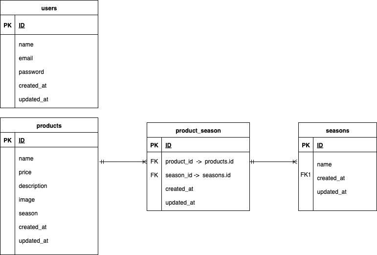

# Mogitate (フリマアプリ)

## 環境構築

### Docker ビルド

```bash
     git clone <https://github.com/shiroyama373/Mogitate.git>
    docker-compose up -d --build
```
注意: MySQL は OS によって起動しない場合があります。その場合は、docker-compose.yml を編集し、環境に合わせて調整してください。

Laravel 環境構築
```bash
docker-compose exec php bash
composer install
cp .env.example .env
.env の DB_DATABASE、DB_USERNAME、DB_PASSWORD は docker-compose.yml に合わせる
php artisan key:generate
php artisan migrate
php artisan db:seed
ログインに必要なユーザー情報は src/database/seeders/UsersTableSeeder.php に記載
php artisan storage:link
```
⸻

使用技術

	•	PHP: 8.3
	•	Laravel: 10
	•	MySQL:  8.x

⸻

URL
	•	開発環境: http://localhost:8080/
	•	phpMyAdmin: http://localhost:8081/

⸻

## 機能一覧

| 機能       | URL |
|------------|-------------------------------|
| 商品一覧   | /products |
| 商品詳細   | /products/{productId} |
| 商品更新   | /products/{productId}/update |
| 商品登録   | /products/register |
| 検索       | /products/search （※未使用） |
| 削除       | /products/{productId}/delete |

※/products/search は現時点では未使用です。
※ 検索や並び替えは /products に対して GET パラメータとして処理しています。

⸻

## ER 図




### クローン後に行った変更点・注意点
- 重複していた商品データを削除
- ProductSeeder を追加し、ダミーデータを簡単に作成できるようにした
- 画像ファイルを public/images に追加
- storage/logs の権限問題を修正
- 必要なマイグレーション・シーディングを行えるように調整
•	確認方法:
```bash
    php artisan migrate:fresh
    php artisan db:seed --class=ProductSeeder
```